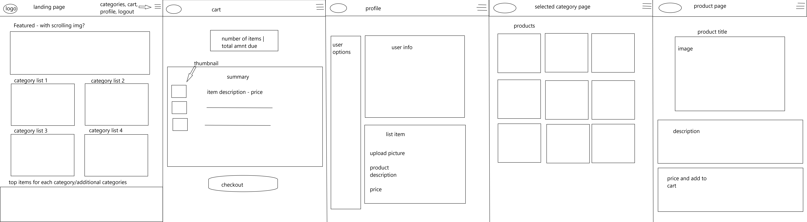

# Features
1. As a user I want to buy products from other users and vendors.
2. As a user I want to search for products, and compare the best prices.
3. As a buyer I want to checkout with cc.
4. As a seller I want to list my products for purchase.
5. As a user I want my own identifiable profile.

# MVP List
### 1. Auth
    * Users can sign up, login, logout.
    * Demo user
### 2. Search
    * Users can search for items they may want to buy.
    * Sellers can tag items for search.
### 3. Cart
    * Users will have a persisting cart.
### 4. Profile
    * Users will have an about page where they can also list items.
### 5. Shopping
    * Sellers will have their products categorized on main page.
    * Main page content will contain most recent additions based on category.
### 6. Heroku
    * Deploy to Heroku.

# Additional Features
### 1. Checkout
    * Credit card checkout
### 2. Edit Profile
    * Users can change profile info after account has been created.

# Schema
Click here for a better visual representation of 
[Schema](https://drawsql.app/solodolo/diagrams/ebay-clone#) <---------------
### User Table
***
| Column name  | Data Type    | constraints       |
| :---        |    :----:   |:---                 |
| id  | integer  | not null, autoIncrement, primary key |
| username   | string        | not null, unique   |
| email      | string        | not null, unique   |
| hashedPassword | string    | not null           |
| created_at | datetime      | not null           |
***
### Products Table
***
| Column name  | Data Type    | constraints       |
| :---        |    :----:   |:---                 |
| id      | integer  | not null, primary key      |
| title   | string        | not null              |
| img     | string        | not null              |
| description | string        |                   |
| category | string        |  not null             |
| price | float        |  not null                 |
| user_id     | integer       | not null, foreign key |
| created_at | datetime      | not null           |
* user_id references User.id
* category references  Category.id
***
### Categories Table
***
| Column name  | Data Type    | constraints       |
| :---        |    :----:   |:---                 |
| id      | integer  | not null, primary key      |
| category   | string       | not null |
***
### Carts Table
***
| Column name  | Data Type    | constraints       |
| :---        |    :----:   |:---                 |
| user_id      | integer  | not null     |
| product_id      | integer  | not null    |
* user_id references Users.id
* product_id references Products.id



# Solo React Project

This is the backend for the Solo React project.

## Getting started

1. Clone this repository
2. Install dependencies (`npm install`)
3. Create a **.env** file based on the example with proper settings for your
   development environment
4. Setup your PostgreSQL user, password and database and make sure it matches your **.env** file with CREATEDB privileges

5. Run
   * `npm run db:create`
   * `npm run db:migrate`
   * `npm run db:seed:all`
   * `npm start`
   * `npm run db:drop` - if you want to quickly drop db
   
## Deploy to Heroku

1. Create a new project
2. Under Resources click "Find more add-ons" and add the add on called "Heroku Postgres"
3. Install the [Heroku CLI](https://devcenter.heroku.com/articles/heroku-command-line)
4. Run `$ heroku login`
5. Add heroku as a remote to this git repo `$ heroku git:remote -a <project_name>`
6. Push the project to heroku `$ git push heroku master`
7. Connect to the heroku shell and prepare your database

```bash
    $ heroku run bash
    $ sequelize-cli db:migrate
    $ sequelize-cli db:seed:all
```
(You can interact with your database this way as youd like, but beware that `db:drop` should not be run in the heroku environment)

8. Add a `REACT_APP_BASE_URL` config var.  This should be the full URL of your react app: i.e. "https://solo-react.herokuapp.com"

9. profit